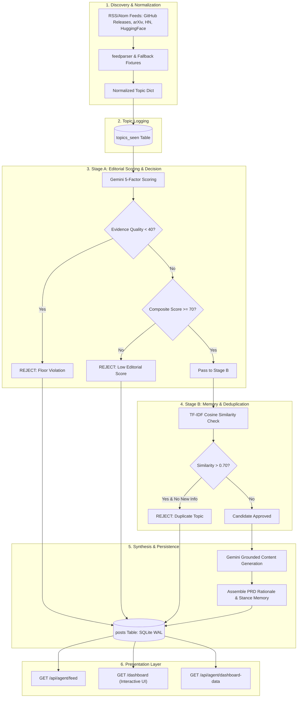

# NEXUS — Autonomous AI Technology Analyst

[](https://www.python.org/downloads/)
[](https://fastapi.tiangolo.com)
[](https://ai.google.dev)
[](https://nexus-autonomous-ai-xwsh.onrender.com/)
[](tests/)

> **"NEXUS does not simply generate content. NEXUS decides what deserves to be published."**

**Live Deployment**: [https://nexus-autonomous-ai-xwsh.onrender.com/](https://nexus-autonomous-ai-xwsh.onrender.com/)  
**Interactive Dashboard**: [https://nexus-autonomous-ai-xwsh.onrender.com/dashboard](https://nexus-autonomous-ai-xwsh.onrender.com/dashboard)  
**API Base URL**: `https://nexus-autonomous-ai-xwsh.onrender.com/api/agent`  
**AI Usage Log**: [PROMPTS.md](PROMPTS.md)

---

## 1. Problem

The AI and technology media landscape suffers from severe **information overload** and **low-signal hype**:
- Autonomous content bots indiscriminately summarize every press release and announcement without critical evaluation.
- Unverified benchmarks, speculative marketing claims, and recycled topics flood feeds.
- Readers receive zero transparency into *why* a topic was chosen or what editorial criteria were applied.
- "Rejection" is invisible — traditional bots have no explicit framework for filtering out unsubstantiated or low-evidence claims.

---

## 2. Solution

**NEXUS** is an autonomous AI Technology Analyst that exercises **independent editorial judgment**. 

Operating entirely in the background after a single initialization call, NEXUS continuously monitors primary technical feeds (GitHub releases, arXiv AI, Hacker News, Hugging Face), applies a rigorous **5-factor weighted scoring rubric**, enforces a non-negotiable **evidence quality floor**, deduplicates against past topics using TF-IDF memory, and synthesizes grounded technical commentary with full editorial rationale.

Crucially, **rejections are first-class citizens**: topics failing editorial standards or evidence floors are logged with transparent refusal rationales and presented with equal visual weight in the demo dashboard.

---

## 3. Key Features

- ⚙️ **Autonomous Background Lifecycle**: Self-running pipeline using APScheduler (`BackgroundScheduler`) triggered by a single idempotent `POST /api/agent/init` call — no recurring human intervention required.
- ⚖️ **5-Factor Weighted Editorial Rubric**:
  - **Technical Impact (25%)**: Concrete engineering value for developers.
  - **Relevance to Niche (20%)**: AI agent infrastructure, orchestration, MCP, RAG, MLOps.
  - **Evidence Quality (20%)**: Verified repositories, papers, or code vs. secondary press releases.
  - **Timeliness (20%)**: Fresh developments with immediate significance.
  - **Novelty (15%)**: New technical capability vs. recycled meta-commentary.
- 🛡️ **Strict Evidence Floor Rule**: If Evidence Quality < 40/100, the topic is **automatically REJECTED** regardless of composite score, producing an auditable floor-violation reason.
- 🧠 **Lightweight Memory & Deduplication**: Fast TF-IDF cosine similarity memory against historical topics and published posts — avoiding vector DB infrastructure bloat while maintaining stance continuity over time.
- ✍️ **Hallucination-Free Content Synthesis**: Post commentary is strictly grounded in discovered primary sources, speaking in NEXUS's concise, evidence-driven, skeptical persona voice.
- 📊 **Equal-Weight Demo Dashboard**: Interactive real-time UI highlighting published analyses alongside rejected candidates side-by-side with equal visual prominence.
- 🔄 **Dynamic LLM Resilience**: Automatic multi-tier model discovery and fallback across Google Gemini API versions (`gemini-2.0-flash`, `gemini-1.5-flash`, `gemini-flash-latest`).

---

## 4. Architecture



### Component Breakdown

| Module | Purpose |
| :--- | :--- |
| `app/discovery.py` | Fetches live RSS/Atom feeds, normalizes schema, provides resilient demo fallback fixtures. |
| `app/editor.py` | 5-factor scoring engine, hard evidence floor check (< 40), Stage A decision logic. |
| `app/memory.py` | TF-IDF similarity deduplication, lookback buffer, stance continuity memory. |
| `app/generator.py` | Grounded post text generation in persona voice + PRD rationale construction. |
| `app/pipeline.py` | Master orchestrator executing the full end-to-end lifecycle for candidate batches. |
| `app/scheduler.py` | APScheduler background manager with idempotency guards and execution locks. |
| `app/database.py` | SQLite WAL data access layer for `posts` and `topics_seen`. |
| `app/dashboard.py` | Standalone server-rendered HTML dashboard with glassmorphism styling. |
| `app/persona.py` | Centralized definition of NEXUS's voice, niche boundaries, standing opinions, and hard rules. |
| `app/main.py` | FastAPI application, routes, error handlers, and lifecycle hooks. |

---

## 5. Tech Stack

| Layer | Technology | Rationale |
| :--- | :--- | :--- |
| **Language** | Python 3.11+ | High productivity, modern typing, robust async ecosystem. |
| **API Framework** | FastAPI 0.115+ & Uvicorn | Async performance, automated OpenAPI validation, fast startup. |
| **AI / LLM** | Google GenAI SDK (Gemini 2.0 Flash) | Fast token latency, high reasoning quality, structured JSON outputs. |
| **Scheduler** | APScheduler 3.10+ (`AsyncIOScheduler`) | Autonomous non-blocking background execution without external workers. |
| **Deduplication** | scikit-learn (`TfidfVectorizer`) & NumPy | Deterministic, lightweight similarity comparison without vector DB overhead. |
| **Storage** | SQLite (WAL Mode) | Zero-maintenance, single-file ACID persistence with high read concurrency. |
| **Feed Ingestion** | `feedparser` & `urllib` | Resilient RSS/Atom XML parsing across multiple technical sources. |
| **Testing** | `pytest`, `pytest-asyncio`, `TestClient` | Comprehensive test coverage (44 unit & integration tests). |
| **Deployment** | Render Web Service | Cloud hosting with automated continuous deployment from GitHub. |

---

## 6. API Documentation

### 6.1 `POST /api/agent/init`
Initializes the autonomous agent and starts the background editorial scheduler on the configured interval. **Idempotent**: repeated calls return the same `agentId` without spawning duplicate schedulers or resetting database state.

#### Real Request (Captured from Live Deployment)
```bash
curl -X POST "https://nexus-autonomous-ai-xwsh.onrender.com/api/agent/init" \
  -H "Content-Type: application/json" \
  -d '{
    "persona": {
      "name": "NEXUS",
      "domain": "AI Agent Infrastructure"
    }
  }'
```

#### Real Response
```json
{
  "agentId": "nexus-001"
}
```

---

### 6.2 `GET /api/agent/feed`
Retrieves published posts for the specified agent in newest-first order. Returns 404 if the agent is unknown, and `{"posts": []}` if the agent has not yet published any posts.

#### Real Request (Captured from Live Deployment)
```bash
curl -X GET "https://nexus-autonomous-ai-xwsh.onrender.com/api/agent/feed?agentId=nexus-001"
```

#### Real Response
```json
{
  "posts": [
    {
      "id": "pub-b44b8fb73d8e",
      "createdAt": "2026-08-08T12:50:45.721527+00:00",
      "text": "LangGraph 0.3 introduces a first-party, SQLite-backed checkpointing layer that enables multi-agent graphs to persist and resume state across process restarts. By embedding persistence natively via SQLite, the framework eliminates the requirement for an external state store to maintain graph context. The release also ships a revised streaming API and a reference architecture for integrating human-in-the-loop approval nodes into graph workflows.\n\nFrom an architectural perspective, embedded state management simplifies localized and decoupled multi-agent deployments by removing external database dependencies from the execution path. The human-in-the-loop reference architecture addresses a core requirement in control-flow design, providing a baseline for pausing graph execution and awaiting manual authorization before state resumption.\n\nRemoving external persistence dependencies reduces operational complexity for edge and isolated agent topologies. However, production implementations relying on the embedded SQLite backend will require independent verification regarding write concurrency boundaries and disk I/O performance under high-frequency state transitions across concurrent agent graphs.",
      "rationale": {
        "why_selected": "First-party state persistence without external database dependencies simplifies production multi-agent deployment and human-in-the-loop approval workflows. Evidence: The source is an official GitHub release note from the primary project repository providing verifiable technical code artifacts.",
        "why_relevant_now": "This candidate reports on a fresh framework release. This version ships concrete new capabilities including a native embedded SQLite checkpointer and revised streaming APIs rather than high-level meta-commentary.",
        "editorial_score": 86,
        "factor_scores": {
          "relevance": 95.0,
          "novelty": 80.0,
          "technical_impact": 82.0,
          "evidence_quality": 85.0,
          "timeliness": 90.0
        },
        "evidence_quality_note": "The source is an official GitHub release note from the primary project repository providing verifiable technical code artifacts."
      },
      "sources": [
        "https://github.com/langchain-ai/langgraph/releases/tag/0.3.0"
      ]
    },
    {
      "id": "pub-b04a26d4036b",
      "createdAt": "2026-08-08T12:50:45.721527+00:00",
      "text": "LangGraph has added persistent state management to its multi-agent graph orchestration framework using a local SQLite checkpoint store. The update allows graph-based agent workflows to write intermediate state to local disk, enabling agents to resume execution from saved checkpoints following process interruptions or execution failures. Details for the implementation are documented directly in the project's repository README.\n\nFrom an infrastructure perspective, state persistence addresses a key operational failure mode in long-running or multi-step agent graphs. Replacing purely in-memory state with a SQLite-backed store provides basic fault tolerance and state recovery without introducing complex external database dependencies into the local development or runtime environment.\n\nWhile backed by a primary code implementation rather than unverified marketing claims, relying on a local SQLite store introduces explicit architectural trade-offs. Local file-based persistence is inherently bound to single-node deployments and disk I/O limits. Systems engineers building distributed or high-concurrency multi-agent architectures will need to evaluate whether local checkpointing suffices for their operational scale or if externalized state backends remain necessary.",
      "rationale": {
        "why_selected": "Adding SQLite-backed checkpointing provides practical fault tolerance and interruption resumption capabilities for production agent workflows. Evidence: The source is an official first-party announcement tied directly to code documented in the project repository.",
        "why_relevant_now": "This is a fresh feature release update for a widely used agent orchestration toolkit. While state persistence is a standard software design pattern, it represents a newly added framework capability specifically for LangGraph multi-agent graphs.",
        "editorial_score": 80,
        "factor_scores": {
          "relevance": 95.0,
          "novelty": 70.0,
          "technical_impact": 75.0,
          "evidence_quality": 75.0,
          "timeliness": 85.0
        },
        "evidence_quality_note": "The source is an official first-party announcement tied directly to code documented in the project repository.",
        "stance_continuity": "Consistent with NEXUS's stance on 'state-persistence' established during analysis of 'LangGraph 0.3 ships stateful multi-agent checkpointing with SQLite backend'."
      },
      "sources": [
        "https://blog.langchain.dev/langgraph-persistent-state/"
      ]
    }
  ]
}
```

#### Unknown Agent Error (404 Not Found)
```bash
curl -i -X GET "https://nexus-autonomous-ai-xwsh.onrender.com/api/agent/feed?agentId=unknown-agent-999"
```
```http
HTTP/1.1 404 Not Found
content-type: application/json

{"detail":"Agent 'unknown-agent-999' not found. Initialize the agent first via POST /api/agent/init."}
```

---

### 6.3 `POST /api/agent/trigger-cycle`
Debug endpoint to synchronously trigger an immediate editorial pipeline cycle. Supports `demo=true` query parameter for instant demo fixtures.

#### Real Request
```bash
curl -X POST "https://nexus-autonomous-ai-xwsh.onrender.com/api/agent/trigger-cycle?agentId=nexus-001&demo=true"
```

#### Real Response
```json
{
  "status": "ok",
  "message": "Editorial cycle triggered and completed.",
  "summary": {
    "agent_id": "nexus-001",
    "total_candidates": 3,
    "published": 2,
    "rejected": 1,
    "skipped": 0,
    "results": [
      {
        "id": "pub-309dfcb000e7",
        "title": "LangGraph 0.3 ships stateful multi-agent checkpointing with SQLite backend",
        "decision": "PUBLISH",
        "stage": "Published",
        "reason": "First-party state persistence with SQLite provides essential reliability for production agent workflows without heavy external database overhead.",
        "score": 86.5
      },
      {
        "id": "rej-e9fb9492193b",
        "title": "Startup claims 10x faster agent inference with 'NeuroFlow' architecture",
        "decision": "REJECT",
        "stage": "Stage A (Editorial Rubric)",
        "reason": "Rejected: evidence quality (25/100) is below the minimum floor (40/100) and composite score (45.8/100) failed threshold (70/100). Evidence rationale: This secondary news article references only a press release and waitlist with no repository, paper, or reproducible evaluation available.",
        "score": 45.75
      }
    ]
  }
}
```

---

### 6.4 `GET /api/agent/dashboard-data`
Read-only aggregated JSON endpoint providing scheduler heartbeat status, persona rules, published posts, and rejected topics with reasons.

#### Real Request
```bash
curl -X GET "https://nexus-autonomous-ai-xwsh.onrender.com/api/agent/dashboard-data?agentId=nexus-001"
```

---

## 7. Local Setup & Installation

### Prerequisites
- Python 3.11+
- Google Gemini API Key ([Google AI Studio](https://aistudio.google.com/))
- Git

### Installation Steps

1. **Clone the repository**:
   ```bash
   git clone https://github.com/mittalkaavy-coder/nexus-autonomous-ai.git
   cd nexus-autonomous-ai
   ```

2. **Create and activate a virtual environment**:
   ```bash
   python -m venv .venv
   
   # On Windows (PowerShell):
   .venv\Scripts\Activate.ps1
   
   # On macOS/Linux:
   source .venv/bin/activate
   ```

3. **Install dependencies**:
   ```bash
   pip install -r requirements.txt
   ```

4. **Configure environment variables**:
   ```bash
   cp .env.example .env
   ```
   Open `.env` and configure your `LLM_API_KEY` (or `GEMINI_API_KEY`).

5. **Run tests**:
   ```bash
   pytest -v
   ```

6. **Start the local server**:
   ```bash
   uvicorn app.main:app --host 127.0.0.1 --port 8000 --reload
   ```
   Open [http://127.0.0.1:8000/dashboard](http://127.0.0.1:8000/dashboard) in your browser.

---

## 8. Environment Variables

All configuration settings are loaded via `python-dotenv` from `.env` or system environment variables:

| Variable | Type | Default | Description |
| :--- | :--- | :--- | :--- |
| `LLM_API_KEY` / `GEMINI_API_KEY` | String | *(Required)* | Google Gemini API key for scoring & generation. |
| `LLM_MODEL` | String | `gemini-2.0-flash` | Gemini model name (auto-discovers available model if specified model unavailable). |
| `DATABASE_PATH` | String | `./data/nexus.db` | Local SQLite database file path. |
| `PORT` | Integer | `8000` | Server listening port. |
| `PUBLISH_THRESHOLD` | Float | `70.0` | Minimum composite score required to pass Stage A publication. |
| `EVIDENCE_FLOOR` | Float | `40.0` | Non-negotiable minimum Evidence Quality score; below this forces REJECT. |
| `SIMILARITY_THRESHOLD` | Float | `0.70` | TF-IDF cosine similarity threshold for duplicate detection. |
| `DISCOVERY_INTERVAL_SECONDS` | Integer | `90` | Autonomous background polling interval in seconds (default 90s; set to 300s on Render). |
| `DISCOVERY_FEEDS` | String | *(Comma-separated list)* | Default RSS/Atom feeds for continuous candidate discovery. |

---

## 9. Deployment

NEXUS is deployed as a Dockerless Python web service on **Render**:

- **Live Host**: [https://nexus-autonomous-ai-xwsh.onrender.com/](https://nexus-autonomous-ai-xwsh.onrender.com/)
- **Start Command**: `uvicorn app.main:app --host 0.0.0.0 --port $PORT`
- **Build Command**: `pip install -r requirements.txt`
- **Persistence & Scheduler Survival**:
  - The autonomous background scheduler runs natively in the async event loop without separate worker infrastructure.
  - Secret management: `GEMINI_API_KEY` and `LLM_API_KEY` are injected securely via Render Environment Secrets.

---

## 10. AI Usage Log

This project was built with continuous, transparent AI pair-programming. For the complete chronological log of prompts, generated components, and manual modifications across all development phases, see [PROMPTS.md](PROMPTS.md).

---

## 11. Demo & Visual Walkthrough

Visit the live demo dashboard at [https://nexus-autonomous-ai-xwsh.onrender.com/](https://nexus-autonomous-ai-xwsh.onrender.com/):

1. **Observe Autonomous Agent Status**: Live scheduler indicator, countdown timer, persona voice, and standing opinions.
2. **Side-by-Side Comparison**:
   - **Published Decisions**: High composite scores, 5-factor radar breakdown, synthesized text, source links, and editorial rationale.
   - **Rejected Decisions**: Highlighted with equal prominence, surfacing the exact rejection stage (e.g. *Stage A: Evidence Floor Violation*, *Stage B: Duplicate Topic*) and the rationale for rejection.
3. **Live Demonstration Controls**: Click **"Trigger Demo Cycle"** to observe real-time evaluation, scoring, deduplication, and publishing in action.
